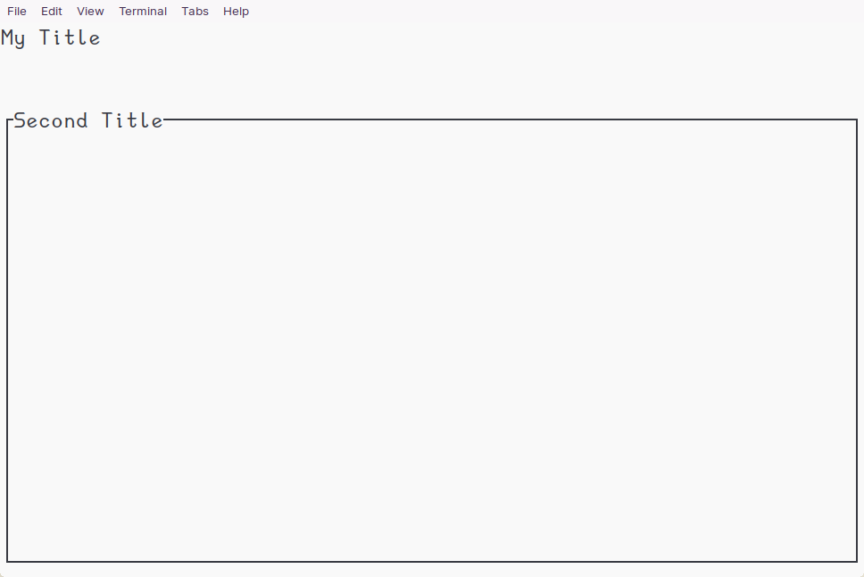
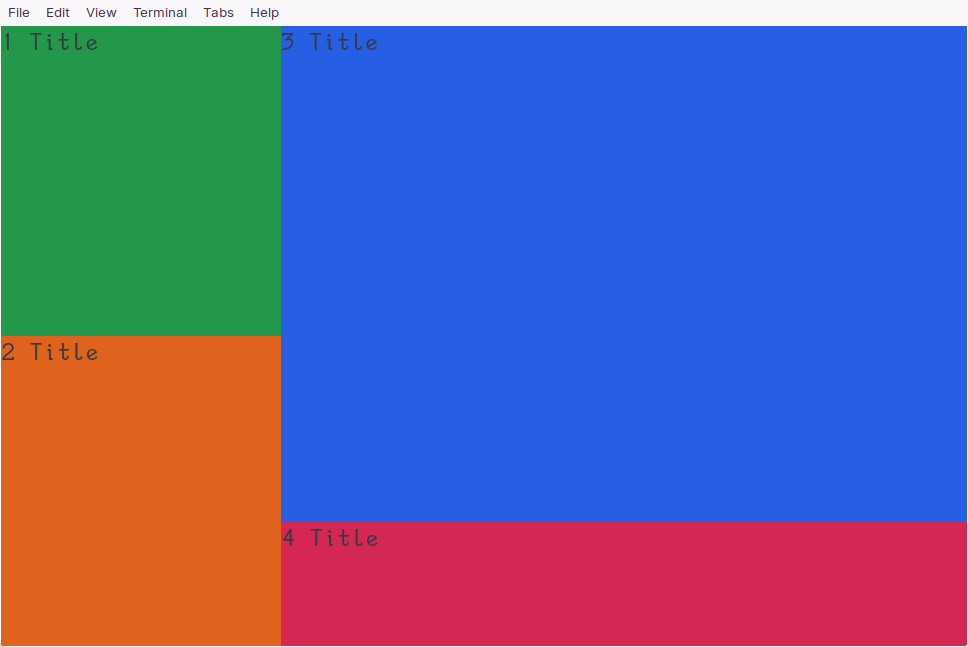
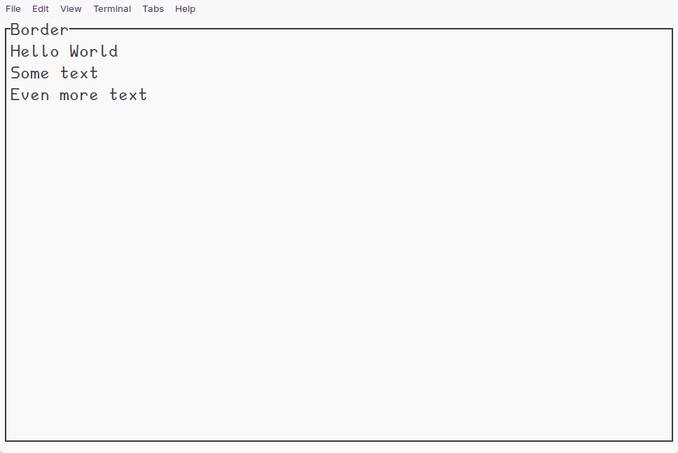

# Creating great Terminal UI in Rust

Creating CLI tools with good looking UI can be a tricky undertaking.
This is especially true for big projects, where you can quickly run
into the issue of having to handle many different edge cases.
Rust is a great language to create CLI tools in, given that it's both
safe and performant and simply a joy to write code in.
One popular crate for creating TUI is the [`ratatui`](https://github.com/ratatui-org/ratatui) crate.
It's quite powerful and you can basically create any TUI you
would want to. However I found that there is a lack of
articles for newcomers to get a foot in the door.
So that's why I am writing this article!

In the following sections I will walk you through some of the main features
to know about the `ratatui` crate.
Note that I won't be using any explicit examples, instead I will try my best to
explain what kind of architecture you could create.
I advice you to take a look at the [ratatui examples](https://github.com/ratatui-org/ratatui/tree/main/examples)
which are very useful to tip your toes into the world of TUI.
With that out of the way, let's take a look at the core of `ratatui`.

## The Main Loop

Every TUI system has three important features:

```
- struct App
- fn run_app<B: Backend>(terminal: &mut Terminal<B>, mut app: App) -> io::Result<()>
- fn ui<B: Backend>(f: &mut Frame<B>, app: &App)
```

The `App` contains all the relevant information about our current app.
We use it to store data between frame updates.
The `run_app` contains the main loop which we use to update our terminal.
It handles user input and calling the UI update through the `ui` function.
The `ui` handles everything related to drawing our UI on our terminal.
Of course the names can be arbitrary, but this is what all examples in the
`ratatui` crate use and there is no good reason to not use them here as well.

## How to draw UI

As stated above, we draw our UI in the `ui` function.
To draw UI components we must define a [widget](https://docs.rs/ratatui/latest/ratatui/widgets/index.html),
For instance to define a simple block we can write

```rust
let upper_block = Block::default()
    .borders(Borders::NONE)
    .title(Title::from("My Title"));
let lower_block = Block::default()
    .borders(Borders::ALL)
    .title(Title::from("Second Title"));
```

This defines *what* we render. Now we also need to define *where* to render it.
We do that by creating a [Rect](https://docs.rs/ratatui/latest/ratatui/layout/struct.Rect.html)

```rust
let size = f.size();
let chunks = Layout::default()
    .direction(Direction::Vertical)
    .constraints([Constraint::Length(3), Constraint::Min(0)])
    .split(size);
```

In this case `chunks` is of type `Rc<[Rect]>` with a length of 2.
The `f` we use here is the `f` we pass into the function as a parameter.
We tell the code to use the whole terminal screen and split it
into two sections along the vertical axis.
We get one area which is 3 lines in height and another that
will take up the remaining space available.
Because we didn't specify anything for the horizontal axis yet
it will take up the entire length of the terminal screen
(because `f.size()` is the entire length).
To now finally render this, we call

```rust
f.render_widget(upper_block, chunks[0]);
f.render_widget(lower_block, chunks[1]);
```

<p align="center">
    
    <br>
    Basic UI components in a simple arrangement.
    <a href="https://github.com/PraxTube/blog/blob/master/ratatui-intro/src/example_1.rs">source</a>
</p>

It's helpful to really think about these two fields as the
*what* and the *where* in terms of our UI component.
Note that they are independent of each other,
you can render any kind of `widget` with any kind of `area`.
Let's take a deeper look at how you can fine-tune these.

### Widgets (The What)

There are quite a lot of built in widgets like the `List, Table, Chart, Gauge`
just to name of few. You can pretty much create anything you would need
in a UI with the built-ins, so if you ever find yourself thinking that you
must create your own widget really take a step back and consider what you need.
In order to understand the widgets deeper you can take a look at the
previously mentioned [examples in the tui repository](https://github.com/fdehau/tui-rs/tree/master/examples).
This should cover pretty much most use cases you would encounter in the early to mid stages of a project.

### Area (The Where)

There are multiples  way you could define areas,
but the most common one is to split the main frame into the desired areas.
You do this by setting the `direction`, which states
along which axis to create the chunks, and the `constraints`, which
lets you define how many chunks to create and in what ratio to create them.
Lets consider the following

```rust
let chunks = Layout::default()
    .direction(Direction::Horizontal)
    .constraints([Constraint::Percentage(30), Constraint::Percentage(70)])
    .split(size);
```

Here we create two areas with the left one taking up 30% of the area `size` and
the right one 70%. The Orientation is horizontal (left to right).
In order to further cut these we could write

```rust
let sub_chunks_left = Layout::default()
    .direction(Direction::Vertical)
    .constraints([Constraint::Percentage(50), Constraint::Percentage(50)])
    .split(chunks[0]);

let sub_chunks_right = Layout::default()
    .direction(Direction::Vertical)
    .constraints([Constraint::Percentage(80), Constraint::Percentage(20)])
    .split(chunks[1]);
```

<p align="center">
    
    <br>
    4 blocks rendered to different areas on the screen.
    <a href="https://github.com/PraxTube/blog/blob/master/ratatui-intro/src/example_2.rs">source</a>
</p>

Which would create 4 areas in total. This alone is already
enough to create most UI arrangements, however there are two
more things you should be aware of: Margins and Constraints

It can be useful to set Margins for certain areas, for example
when you have one widget inside another one, e.g. when
you want to have text surrounded by a block.

```rust
let size = f.size();
let block = Block::default().title("Border").borders(Borders::ALL);
f.render_widget(block, size);

let chunks = Layout::default()
    .direction(Direction::Vertical)
    .margin(1)
    .constraints([Constraint::Min(1), Constraint::Length(2)])
    .split(size);

let message_top = Paragraph::new("Hello World\nSome text\nEven more text")
    .block(Block::default().borders(Borders::NONE));
f.render_widget(message_top, chunks[0]);
```

<p align="center">
    
    <br>
    Block with text inside using margin.
    <a href="https://github.com/PraxTube/blog/blob/master/ratatui-intro/src/example_3.rs">source</a>
</p>

Here `block` is a simple border and the two text components
will be inside of this border.
Also take note of the `Constraint` here. We already
saw a few different ones like `Percentage, Min, Length`.
The `Constraint` is really powerful, as it allows you to create
pretty much any Ratios you would need.
This is also why creating the areas relative to the terminal size
is the recommended way. It's pretty easy and most flexible, the size
of the user's terminal is of no concern to you the developer.

Okay so now that we have seen how we can
define our *what* and *where*,
it's time to look at how to store our data using the `App`.

## How to store Data

Managing information in programming is generally a tricky part.
This is no exception. The easiest way for us to store
information throughout frame updates is to do so directly in the `App`.
This however quickly becomes unfeasible as we need to store
more and more data. One possible way to solve this
is to store `struct`s in the `App`, which then store the data relevant to them.
So for instance

```rust
struct App {
    confirmation_data: confirmation::Data,
    text_prompt_data: text_prompt::Data,
    song_data: song::Data,
}
```

This might seem a little overkill for very small
projects, but I assure that you will quickly need
to split up the logic as your projects grows.

## Managing multiple Controllers

You will eventually want to have multiple controllers
for different UI states. For instance you might
have a UI component that asks the user for a string input
and another one that is a simple confirmation pop up.
You can't have the same controller for both of these,
instead you have two separate ones, and you call whichever
is currently in use. Here we could write

```rust
pub enum Controller {
    Main,
    FuzzyFinder,
    Confirmation,
}
```

and then we check which controller to call with

```rust
fn run_app<B: Backend>(
    terminal: &mut Terminal<B>,
    mut app: App,
    tick_rate: Duration,
) -> io::Result<()> {
    let mut last_tick = Instant::now();
    loop {
        terminal.draw(|f| ui(f, &mut app))?;
        match app.controller {
            Controller::Main => main_controller::<B>(&mut app, tick_rate, &mut last_tick),
            Controller::FuzzyFinder => fuzzy_finder::controller::<B>(&mut app, tick_rate, &mut last_tick),
            Controller::Confirmation => confirmation::controller::<B>(&mut app, tick_rate, &mut last_tick),
        }?;
    }
}
```

In each controller we can now define custom key bindings and
have completely separate logic in them.
Of course this is only a suggestion, there are absolutely other ways
to structure your code. This is simply the way I have been
writing it in my project and I wanted to give you a point to
start. This goes for everything I have been showing you here.

## Conclusion

In this article I went over the bigger picture of how to
structure a TUI rust project using the `ratatui` crate.
We saw how to create `widgets` and `areas` and how to
store data throughout frame updates in an `App`.
I also showed you how to create multiple controllers
to handle different logic for your UI components.
All in all this was merely an overview of what
you can do and how you might want to structure
your project. It's still highly advisable to look through the
[ratatui examples](https://github.com/ratatui-org/ratatui/tree/main/examples)
to get a basic understanding of how to create UI components.
Remember that nothing I displayed here is a must,
you are free to structure your code in any way you want.
It's simply a guideline which you can follow if you want to,
in case you are unsure how to structure your TUI project.
